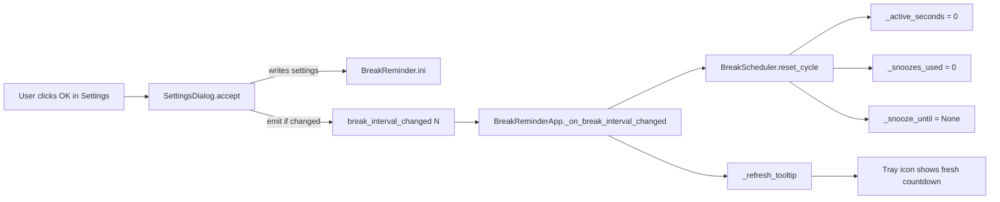

# Break-cycle reset on settings save (S-09) — Plan Brief

> Full plan: `context/changes/bugfix-break-cycle-reset-on-save/plan.md`

## What & Why

Fix the defect where saving a new break interval from `SettingsDialog` doesn't reset `BreakScheduler._active_seconds`, leaving the tray-tooltip countdown showing a stale sub-minute offset (e.g., the seconds digit appears frozen at the prior cycle's offset because both old and new thresholds are multiples of 60). The functional consequence is the next break firing up to 59 seconds early or late relative to the new threshold — small, but a real correctness gap in FR-006 (configurable break interval) and the FR-008 active-time accumulator.

## Starting Point

`BreakScheduler._active_seconds` is reset by `on_break_taken()` / `on_break_snoozed()` / construction only. `SettingsDialog.accept()` writes `Settings.break_interval_min` but emits no signal and is unaware of either scheduler. The signal-from-dialog → app.py → scheduler shape already exists for reminders (`ReminderFormDialog.reminder_added` → `SettingsDialog._refresh_reminders_tab` → `ReminderScheduler.reload()`), so the fix follows an established pattern one level higher.

## Desired End State

After the user changes the break interval and clicks OK, the tray tooltip immediately reads `BreakReminder — next break in Nm 00s` (or `(N-1)m 59s` after the next 1-second tick), and the next break fires exactly `N × 60` active seconds from that moment. Saving Settings without changing the break interval does NOT reset the cycle. Snooze-in-flight at Save time is cleared when (and only when) the break interval changed.

## Key Decisions Made

| Decision | Choice | Why (1 sentence) |
| --- | --- | --- |
| Reset trigger | Only when `break_interval_min` actually changed | Minimum-surprise — saving unrelated settings shouldn't disturb the active cycle |
| Reset payload | All three fields (`_active_seconds`, `_snoozes_used`, `_snooze_until`) | Mirrors `on_break_taken` exactly — a stale snooze window against a new threshold is meaningless |
| `max_snoozes` clamp | No — `_snoozes_used` is left alone | Inconsistency self-heals on next `on_break_taken()`; clamping adds a second mode of mid-cycle state mutation |
| Wiring shape | `SettingsDialog` emits `break_interval_changed(int)` before `super().accept()`; `app.py` connects in `_on_open_settings` before `dialog.exec()` | Mirrors the existing `reminder_added` signal/slot wiring; keeps the dialog and the scheduler decoupled via a Qt signal |
| Method extraction | New `BreakScheduler.reset_cycle()`; `on_break_taken` delegates to it | Zero-behavior-change refactor; lets the new path call `reset_cycle` without semantically misusing `on_break_taken` (which would inflate the FR-015 TAKEN count if reused via `_apply_break_taken`) |

## Scope

**In scope:**
- New public method `BreakScheduler.reset_cycle()` (extract `on_break_taken` body)
- New class signal `SettingsDialog.break_interval_changed = Signal(int)` emitted only on actual change
- New private slot `BreakReminderApp._on_break_interval_changed`
- Three new test classes (`TestResetCycle`, `TestBreakIntervalChangedSignal`, `TestOnBreakIntervalChanged`)
- `change.md` status flip in Phase 2

**Out of scope:**
- Reset on snooze-duration / max-snoozes changes
- New `Settings` keys
- Tray icon, event-log, or installer changes
- AGENTS.md edit (no new load-bearing pattern)
- Roadmap S-09 status flip (that's `/10x-archive`'s job)

## Architecture / Approach

Three production files, three test files. The signal is emitted from `accept()` only when `old_interval != new_interval`. The slot is connected in `_on_open_settings()` BEFORE `dialog.exec()` so the signal — which fires inside `accept()` during `exec()` — has a live receiver.

## Phases at a Glance

| Phase | What it delivers | Key risk |
| --- | --- | --- |
| 1. Implementation | `reset_cycle()` extraction, signal, slot, three new test classes, full automated CI green | Test-shape mismatch with existing `TestOnBreakTaken` if the refactor changes observable behavior — pinned by mirroring the same four assertions verbatim |
| 2. Bookkeeping | `change.md` status: `planned` → `implemented` | None — single-line frontmatter edit |

**Prerequisites:** S-01 through S-04 all shipped (the Scheduling tab and `BreakScheduler` are both in their final v0.6.0 shape). No upstream blockers.

**Estimated effort:** ~1 session — three small production touches, three test classes mirroring an existing class, one bookkeeping edit.

## Open Risks & Assumptions

- **Assumption**: Connecting `dialog.break_interval_changed` after constructing the `SettingsDialog` but before `dialog.exec()` will deliver the signal during `accept()` (which runs synchronously inside `exec()`). This is standard Qt direct-connect semantics; `tests/test_reminder_form_dialog.py:test_save_emits_reminder_added_before_super_accept` already pins this for the analogous `reminder_added` path.
- **Risk**: A user mid-snooze clicking OK in Settings with no break-interval change still wants their current snooze respected. The plan honors this — when `old_interval == new_interval`, the signal does not fire and `_snooze_until` is preserved. Pinned by `TestBreakIntervalChangedSignal.test_no_emit_when_value_unchanged` plus a manual smoke step.

## Success Criteria (Summary)

- Tray tooltip immediately re-reads as a fresh countdown when the user changes the break interval and clicks OK.
- Tray tooltip continues counting down unchanged when the user saves Settings WITHOUT changing the break interval.
- Snooze-in-flight is cleared (and only cleared) when the break interval was actually changed.
